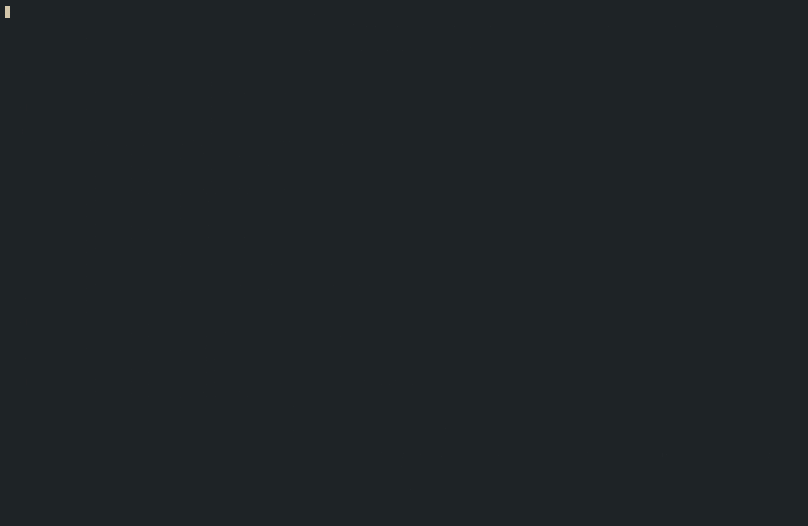

# har-viewer

A terminal UI for inspecting [HAR](https://en.wikipedia.org/wiki/HAR_(file_format)) (HTTP Archive) files. Browse requests, inspect headers, view response bodies with JSON syntax highlighting, preview images, and analyze timing breakdowns — all from the command line.



## Installation

### Homebrew (macOS and Linux)

```sh
brew tap nassendelft/har-viewer
brew install har-viewer
```

### Download a release

Pre-built binaries are available on the [releases page](https://github.com/nassendelft/har-viewer/releases) for:

- macOS (Apple Silicon)
- Linux x86-64

## Usage

```sh
har-view <file.har>
```

## Navigation

| Key | Action |
|-----|--------|
| `↑` / `↓` or `j` / `k` | Move through the request list |
| `Enter` | Focus the detail panel |
| `r` | Focus the requests panel |
| `/` | Open the regex filter |
| `Esc` / `Enter` | Close the filter |
| `←` / `→` or `h` / `l` | Scroll URLs horizontally (requests panel) |
| `1` | Switch to Request tab |
| `2` | Switch to Resp Headers tab |
| `3` | Switch to Body tab |
| `4` | Switch to Diagnostics tab |
| `5` | Switch to Image tab (image responses only) |
| `↑` / `↓` or `j` / `k` | Scroll content (detail panel) |
| `Ctrl+U` / `Ctrl+D` | Scroll up/down half a page |
| `Ctrl+B` / `Ctrl+F` or `PgUp` / `PgDn` | Scroll up/down a full page |
| `←` / `→` or `h` / `l` | Scroll body horizontally (Body tab) |
| `p` | Toggle JSON pretty-print (Body tab) |
| `q` / `Ctrl+C` | Quit |

## Features

- **Color-coded methods** — GET, POST, PUT, PATCH, DELETE and more are each a distinct color
- **Regex filter** — press `/` to filter requests by URL using a regular expression
- **Method and type filters** — press `f` to filter by HTTP method and resource type; no selection shows all, selecting narrows results
- **Request tab** — overview, query parameters, request headers, cookies, and request body
- **Resp Headers tab** — response status, headers, cookies, and redirect target
- **Body tab** — response body with syntax highlighting for JSON, HTML/XML, JavaScript, and form data; horizontal scrolling; and JSON pretty-print toggle
- **Diagnostics tab** — visual timing bars for blocked, DNS, connect, SSL, send, wait, and receive phases, plus cache state
- **Image tab** — renders image responses directly in the terminal; uses the [Kitty graphics protocol](https://sw.kovidgoyal.net/kitty/graphics-protocol/) where supported, falling back to Unicode half-block characters with 24-bit color

## Building from source

Requirements: JDK 17+, CMake, a C++ toolchain.

```sh
git clone --recurse-submodules https://github.com/nassendelft/har-viewer.git
cd har-viewer
./gradlew :app:linkReleaseExecutableMacosArm64   # macOS Apple Silicon
./gradlew :app:linkReleaseExecutableLinuxX64      # Linux x86-64
```

The binary is written to `app/build/bin/<target>/releaseExecutable/app.kexe`.

## License

[GPL-3.0](LICENSE)
